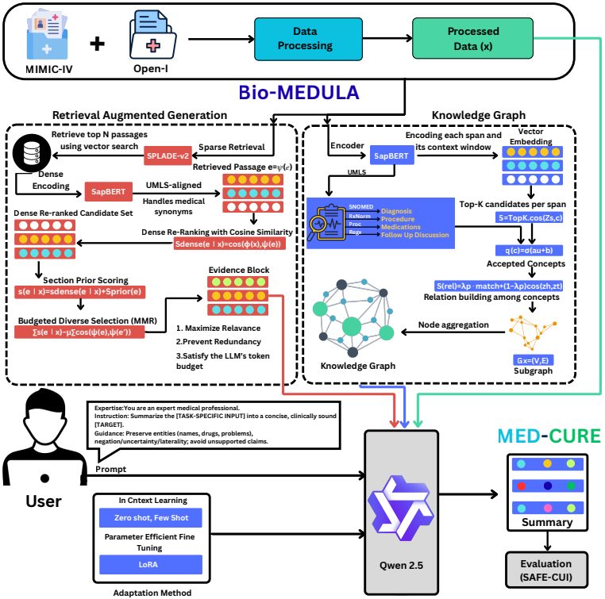

# MED-CURE: Medical Evidence-Driven Clinical Understanding and Retrieval Engine for Safe LLM Summarization Integrating Retrieval-Augmented Generation and Knowledge Graph Grounding


This work introduces **MED-CURE**, a knowledge-grounded clinical summarization framework that combines **retrieval-augmented generation (RAG)** with **UMLS-grounded knowledge graph (KG)** reasoning under the auditable **BioMEDULA** dual-channel architecture.

The retrieval channel employs a clinically-tuned **sparse-dense pipeline** (SPLADE-v2 with SapBERT re-ranking) with section-aware priors and token-budgeted Maximal Marginal Relevance (MMR) to select diverse, high-quality evidence. In parallel, an input-conditioned clinical knowledge graph constrains decoding via concept-consistent realization and relation plausibility checks, discouraging clinically unsupported statements.

The generator is a large language model (Qwen-2.5 / Mistral / LLaMA family) adapted via **QLoRA** (parameter-efficient fine-tuning) and **zero shot, few shot** (In contest learning), enabling reproducible training and inference under modest computational budgets.

We evaluate MED-CURE on two complementary clinical summarization benchmarks:
- long-form **discharge summary generation** from **MIMIC-IV**
- qualifier-sensitive **Findings-to-Impression** generation on **Open-i**

MED-CURE achieves strong automatic performance (ROUGE-L 0.54, BERTScore 0.88 on MIMIC-IV; ROUGE-L 0.64, BERTScore 0.92 on Open-i) while significantly improving readability and reducing clinically unsafe content compared to strong baselines.

We further introduce **SAFE-CUI**, a UMLS-normalized safety evaluation metric that measures category-wise concept fidelity (diagnosis, procedure, medication, follow-up), qualifier preservation, relation plausibility, and unsupported concept rate, revealing error patterns invisible to surface-level metrics.

## Architecture Overview – BioMEDULA Dual-Channel Design


## Main Contributions

- Clinically-tuned **sparse-dense RAG pipeline** with section-aware priors and MMR diversity under strict token budget
- Input-conditioned **UMLS-grounded knowledge graph** with SapBERT entity linking and relation plausibility constraints
- Confidence-weighted entity masking and minimal-revision relation plausibility objective during generation
- Introduction of **SAFE-CUI** - a new UMLS-normalized clinical faithfulness metric
- Comprehensive evaluation on MIMIC-IV discharge summarization and Open-i radiology report summarization
- Open-source implementation with reproducible training and evaluation pipeline


## Requirements

```bash
# Recommended Puhti / CSC cluster environment
module load pytorch

# Install additional packages in user space
pip install --user \
  torch transformers>=4.44.0 \
  datasets peft accelerate \
  evaluate rouge-score bert-score \
  sentence-transformers \
  splade \
  spacy \
  https://s3-us-west-2.amazonaws.com/ai2-s2-scispacy/releases/v0.5.0/en_core_sci_sm-0.5.0.tar.gz

